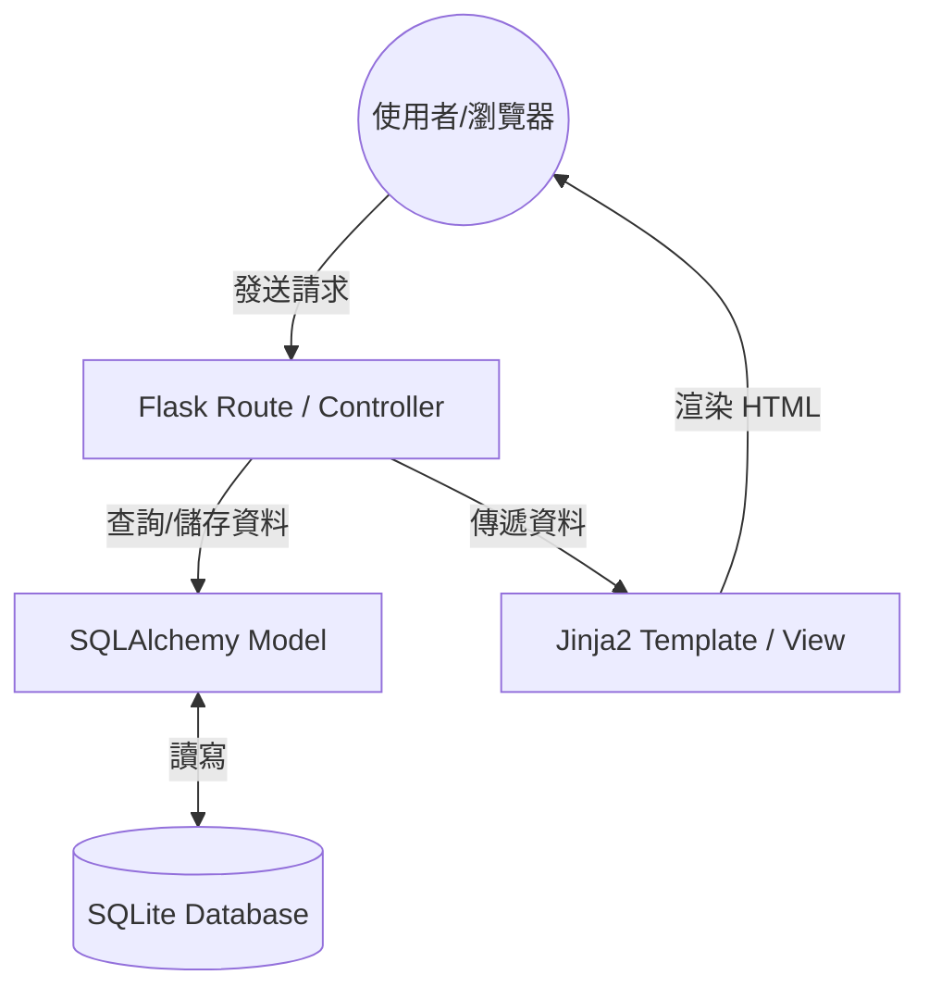

# 系統架構文件 (ARCHITECTURE.md)

本文件說明「食譜收藏夾」系統的技術架構、資料夾結構與設計決策，旨在為後續開發提供清晰的藍圖。

## 1. 技術架構說明

本專案採用經典的單體架構 (Monolithic Architecture)，結合 Flask 框架提供的 MVC (Model-View-Controller) 模式進行開發。

### 選用技術與原因
- **後端：Python + Flask**
  - **原因**：Flask 輕量且彈性高，適合快速開發 MVP（最小可行性產品）。Python 擁有豐富的函式庫，有利於未來實作個人化推薦演算法。
- **模板引擎：Jinja2**
  - **原因**：Flask 內建支援，能直接將後端資料渲染至 HTML 頁面，不需要額外設定前後端分離的 API 與前端框架，開發效率極高。
- **資料庫：SQLite (搭配 SQLAlchemy)**
  - **原因**：無需額外安裝資料庫伺服器，資料儲存於單一檔案中，易於攜帶與備份，非常適合個人使用的食譜收藏系統。

### Flask MVC 模式說明
- **Model (模型)**：由 `app/models/` 負責。定義資料結構（如：食譜名稱、食材、步驟等），並與 SQLite 資料庫進行互動。
- **View (視圖)**：由 `app/templates/` 負責。使用 Jinja2 模板撰寫 HTML，負責將資料呈現給使用者。
- **Controller (控制器)**：由 `app/routes/` 負責。處理使用者的請求（Request），從 Model 取得資料後交給 View 渲染，是系統的邏輯核心。

---

## 2. 專案資料夾結構

建議的資料夾結構如下，兼顧了模組化與簡潔性：

```text
recipe_collector/
├── app/
│   ├── __init__.py          # 初始化 Flask App 與資料庫連線
│   ├── models/              # 資料庫模型 (食譜、使用者記錄等)
│   │   └── recipe.py
│   ├── routes/              # Flask 路由 (控制器邏輯)
│   │   ├── main.py          # 首頁、每日食譜
│   │   └── recipe.py        # 新增、搜尋、推薦邏輯
│   ├── templates/           # Jinja2 HTML 模板 (視圖)
│   │   ├── base.html        # 基礎版面
│   │   ├── index.html       # 首頁
│   │   └── recipe_detail.html
│   └── static/              # 靜態資源
│       ├── css/             # 樣式表
│       └── js/              # 前端邏輯 (如食譜圖片預覽)
├── instance/
│   └── database.db          # SQLite 資料庫檔案 (不進入版本控制)
├── docs/
│   ├── PRD.md               # 需求文件
│   └── ARCHITECTURE.md      # 本架構文件
├── app.py                   # 專案入口點
├── requirements.txt         # 專案依賴套件清單
└── config.py                # 系統設定 (資料庫路徑、密鑰等)
```

---

## 3. 元件關係圖

以下展示使用者請求如何流經系統元件：



---

## 4. 關鍵設計決策

1. **整合式渲染 (Server-Side Rendering)**
   - **選擇**：直接使用 Flask + Jinja2 渲染頁面，不採用 React/Vue 等前後端分離架構。
   - **原因**：降低開發複雜度，減少維護成本，且個人使用對動態互動的需求較低，SSR 的效能已足夠。

2. **使用 SQLAlchemy 作為 ORM**
   - **選擇**：透過 SQLAlchemy 處理資料庫。
   - **原因**：避免手寫 SQL 語法，降低 SQL Injection 風險，且讓代碼更具可讀性與維護性。

3. **路由模組化 (Blueprints)**
   - **選擇**：將不同功能的路由（如主頁與食譜管理）拆分到不同的檔案中。
   - **原因**：防止單一檔案過於肥大，方便未來擴充「個人化推薦」或「食材管理」等新模組。

4. **簡單的推薦機制優先**
   - **選擇**：MVP 階段的「根據食材推薦」與「個人化推薦」先以簡單的字串比對與隨機挑選實作。
   - **原因**：確保核心功能（新增與搜尋）先上線，後續再根據收集到的資料優化演算法。
