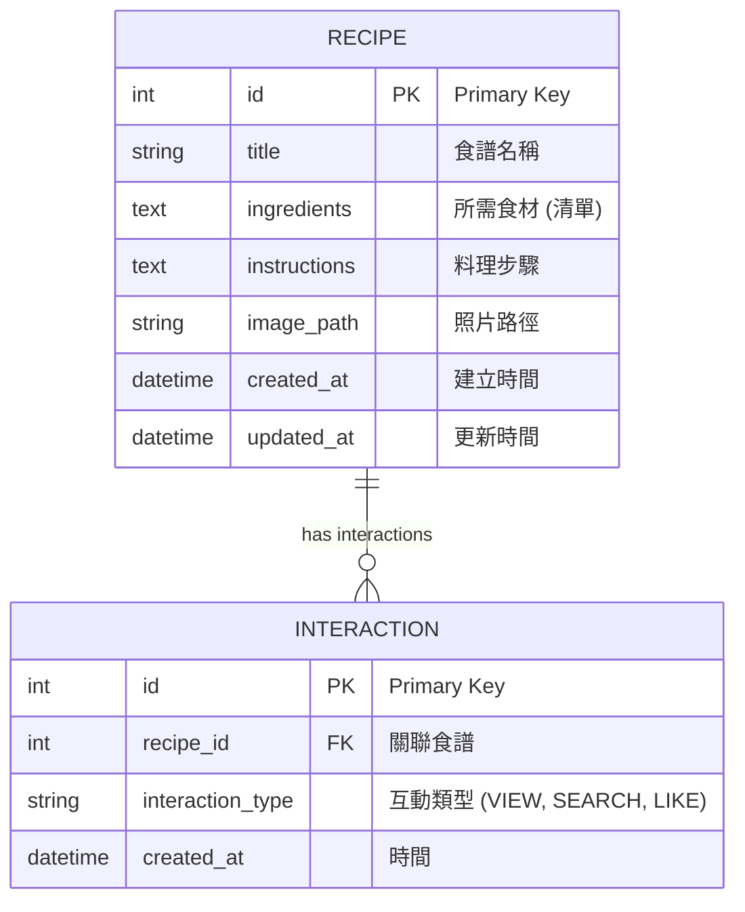

# 資料庫設計文件 (DB_DESIGN.md)

本文件定義「食譜收藏夾」系統的資料庫結構。我們選用 SQLite 作為儲存引擎，並透過 SQLAlchemy 進行 ORM 操作。

---

## 1. ER 圖 (Entity Relationship Diagram)



---

## 2. 資料表詳細說明

### 資料表：`recipes`
儲存食譜的核心資訊。

| 欄位名 | 型別 | 屬性 | 說明 |
| :--- | :--- | :--- | :--- |
| `id` | INTEGER | PK, AutoInc | 唯一識別碼 |
| `title` | VARCHAR(100) | Not Null | 食譜標題 |
| `ingredients` | TEXT | Not Null | 食材內容（建議以換行或特定符號分隔） |
| `instructions` | TEXT | Not Null | 詳細步驟說明 |
| `image_path` | VARCHAR(255) | Nullable | 食譜照片的檔案路徑或 URL |
| `created_at` | DATETIME | Default: Now | 建立紀錄的時間 |
| `updated_at` | DATETIME | Default: Now | 最後修改的時間 |

### 資料表：`interactions`
記錄使用者的操作，用於未來的「個人化推薦」演算法。

| 欄位名 | 型別 | 屬性 | 說明 |
| :--- | :--- | :--- | :--- |
| `id` | INTEGER | PK, AutoInc | 唯一識別碼 |
| `recipe_id` | INTEGER | FK | 關聯到 `recipes.id` |
| `interaction_type`| VARCHAR(20) | Not Null | 操作類型：`view` (瀏覽), `search` (搜尋), `like` (收藏) |
| `created_at` | DATETIME | Default: Now | 操作時間 |

---

## 3. SQL 建表語法 (database/schema.sql)

```sql
-- 建立食譜表
CREATE TABLE IF NOT EXISTS recipes (
    id INTEGER PRIMARY KEY AUTOINCREMENT,
    title VARCHAR(100) NOT NULL,
    ingredients TEXT NOT NULL,
    instructions TEXT NOT NULL,
    image_path VARCHAR(255),
    created_at DATETIME DEFAULT CURRENT_TIMESTAMP,
    updated_at DATETIME DEFAULT CURRENT_TIMESTAMP
);

-- 建立互動記錄表 (用於推薦)
CREATE TABLE IF NOT EXISTS interactions (
    id INTEGER PRIMARY KEY AUTOINCREMENT,
    recipe_id INTEGER,
    interaction_type VARCHAR(20) NOT NULL,
    created_at DATETIME DEFAULT CURRENT_TIMESTAMP,
    FOREIGN KEY (recipe_id) REFERENCES recipes(id) ON DELETE CASCADE
);

-- 建立索引以優化搜尋效能
CREATE INDEX IF NOT EXISTS idx_recipes_title ON recipes(title);
```

---

## 4. Python Model 設計決策

根據 `ARCHITECTURE.md`，我們將使用 **Flask-SQLAlchemy**。
- **檔案路徑**：`app/models/recipe.py` 與 `app/models/interaction.py`。
- **時間處理**：使用 Python 的 `datetime.utcnow` 確保時間格式統一。
- **CRUD 封裝**：每個 Model 類別將包含類別方法（Class Method）以便於 Controller 調用。
