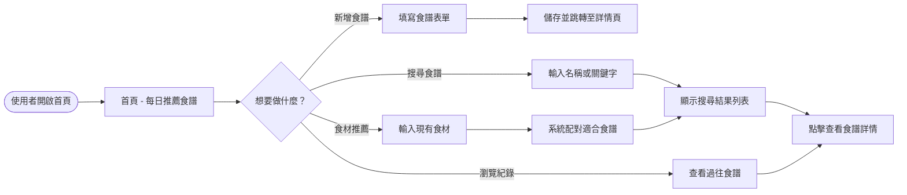
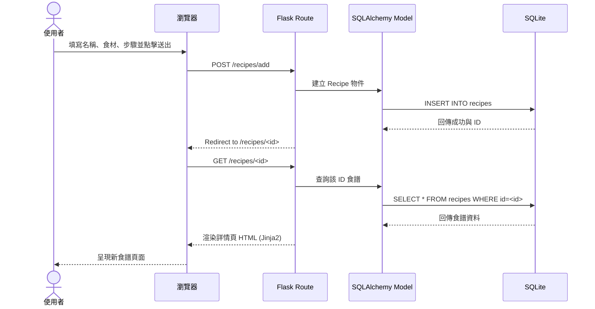
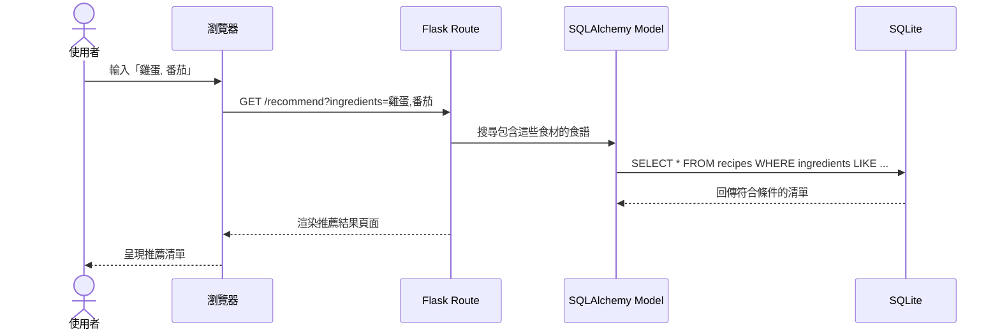

# 系統流程圖文件 (FLOWCHART.md)

本文件透過視覺化圖表描述「食譜收藏夾」的使用者操作路徑與系統內部的資料流動。

---

## 1. 使用者流程圖 (User Flow)

描述使用者從進入系統到完成各項核心功能的流程。

---

## 2. 系統序列圖 (Sequence Diagram)

以「新增食譜」與「搜尋食譜」為例，描述資料如何在各元件間傳遞。

### 場景 A：新增食譜並存入資料庫

### 場景 B：根據食材推薦食譜

---

## 3. 功能清單與路徑對照表

以下為系統規劃的初步 API/路由對照表：

| 功能名稱 | URL 路徑 | HTTP 方法 | 說明 |
| :--- | :--- | :--- | :--- |
| **首頁** | `/` | GET | 顯示每日推薦與功能入口 |
| **新增食譜頁面** | `/recipes/add` | GET | 顯示新增表單 |
| **執行新增** | `/recipes/add` | POST | 接收表單資料並寫入資料庫 |
| **食譜詳情** | `/recipes/<int:id>` | GET | 顯示特定食譜內容 |
| **搜尋/推薦列表** | `/recipes` | GET | 顯示搜尋結果或依食材推薦的結果 |
| **個人化推薦** | `/recommend/personal` | GET | 根據用戶行為推薦食譜 (進階功能) |

---

## 說明

- **重導向 (Redirect)**：在執行新增 (POST) 操作後，系統會重導向至該食譜的詳情頁，以符合「Post-Redirect-Get」模式，避免使用者重新整理頁面時發生重複送出的問題。
- **資料配對**：目前設計中，推薦功能將優先使用簡單的 SQL `LIKE` 語法進行關鍵字比對。
